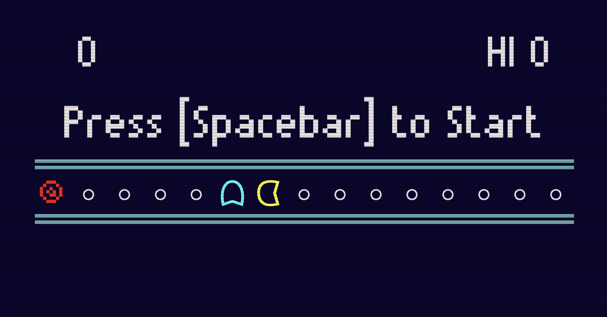
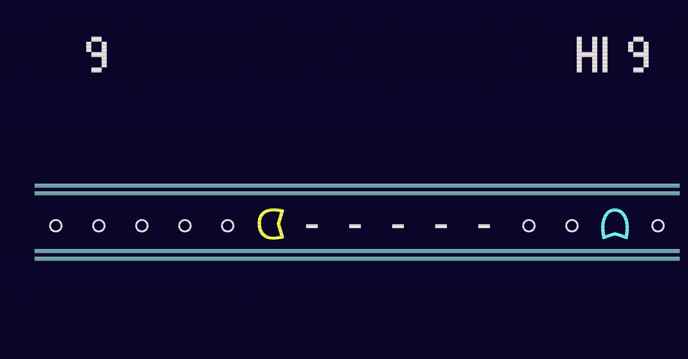
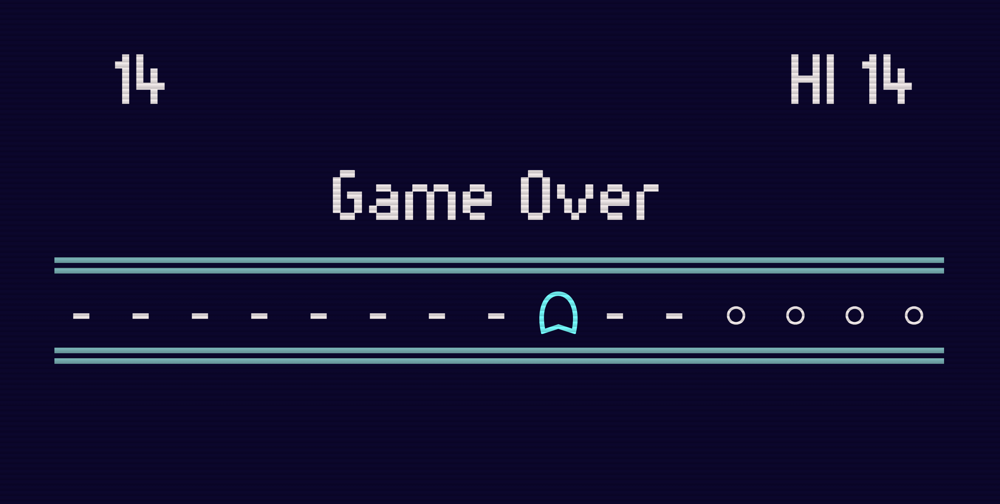

# PakuPaku
A repository representing the PakuPaku JS game for assignment 2 of the CSI3140 class.

## Github
You can find the github repository for the project [here.](https://github.com/Tom-Latimer/PakuPaku)

## Students
Name: Tom Latimer  
Student Number: 300250278  

Name: Ash Bhattarai  
Student Number: 300236157

## Documentation
- [Design System](docs/design_system.md)

## How to play

>**Note:** The game uses JavaScript modules which require you to clone the repo and host it on a local server.  
> The game **will not** work properly if you simply try to double click the index.html file to run it.

### Starting the game
Once the website has been launched, the game will be displayed to you. To start the game, press the spacebar on your keyboard and pacman will begin moving in a direction. After a Game Over, you can press spacebar as well to play again.

### Moving PakuPaku
PakuPaku will move on his own when the game starts. The left arrow makes him go left, and the right arrow will make him go right. Note that you do not need to keep pressing the arrow keys to make him move as he moves on his own; they are only used to change direction.

### Levels
Once PakuPaku eats all the pellets and the fruit on screen, a new level will automatically be created and you will continue to play on it. This will repeat endlessly until you succumb to the ghost.

### Score
The current score of your game is indicated in the top left, while the top right indicates your cumulative high score. See the next section for how the score is affected by points.

### The Goal
The goal of the game is to see how long you can go and get a high score. Each pellet is worth one point, while the fruit is worth 5 points.  

Note that the fruit **will not allow PakuPaku to eat the ghost; it only gives points**. Thus, the ghost is an immovable object which must be avoided at all costs.

### Game Over
The game ends when PakuPaku interacts with a ghost.
